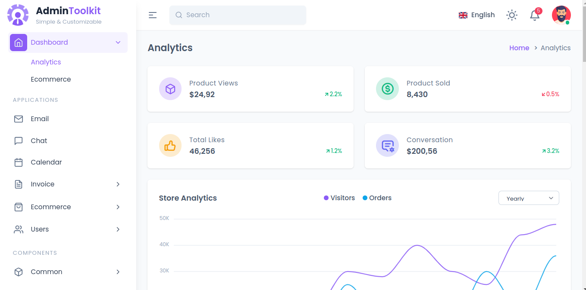
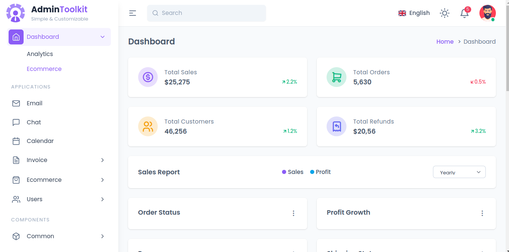
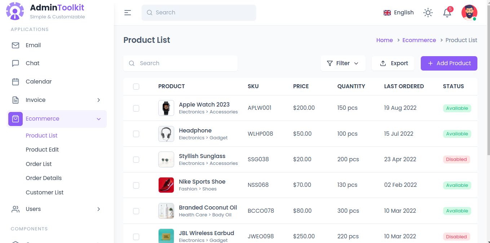

# admintoolkit-laravel
AdminToolkit Laravel version. AdminToolkit is an admin template based on TailwindCSS and Vanilla JavaScript developed by https://github.com/mostafizurhimself 

Go to `https://github.com/SmartWebSource/admintoolkit-laravel` for install document

# Analytics Dashboard

# Ecommerce Dashboard

# Product List

## Route list

- ecommerce
- email
- chat
- calendar
- invoice-create
- invoice-details
- product-list
- product-edit
- order-list
- order-details
- customer-list
- user-list
- user-profile
- accordion
- alert
- avater
- badge
- button
- card
- carousel
- drawer
- dropdown
- list-group
- modal
- pagination
- progress
- skelton
- spinner
- tab
- toast
- tooltip
- input
- input-group
- textarea
- checkbox
- radio
- toggle
- datepicker
- editor
- uploader
- layout
- validation
- basic-table
- data-table
- charts
- icons
- typography
- login
- register
- forget-password
- reset-password

Go to `vendor/smartwebsource/admintoolkit-laravel/src/routes/web.php` for check all route list

After vendor publish you can get all blade views in  `resources/views/vendor/admintoolkit` folder. 

## Customization
if you access or use any page from `resources/views/vendor/admintoolkit` this folder or after move file from the folder you must be changed
all include path like `@include('admin::partials.header')` as your views directory in `layout.blade.php` page and all other page change `@extends('admin::layout')` directory path.

## Note :
if you change this template any js or scss file then run `npm run build` without run this command you can't see change.

